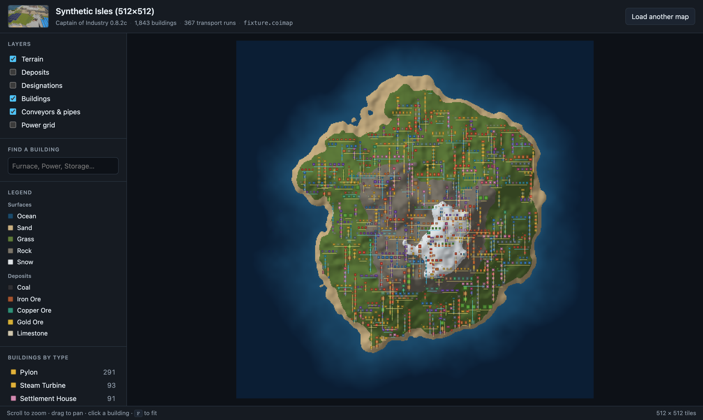
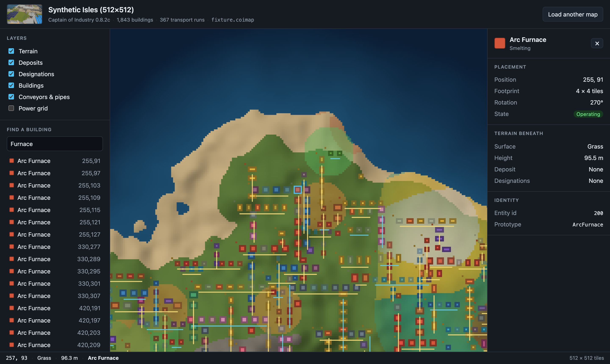

<h1 align="center">coi-mapper</h1>

<p align="center">
  <strong>An interactive web map for <a href="https://www.captain-of-industry.com/">Captain of Industry</a> bases.</strong><br>
  Pan and zoom your factory, toggle layers, and click any building to see what it is.
</p>

<p align="center">
  
  
  
  
</p>

<p align="center">
  
</p>

---

## What it does

Captain of Industry gives you a beautiful 3D factory and no good way to see it all at once.
`coi-mapper` renders your whole base as a fast, zoomable 2D map in the browser — in the spirit
of the [Satisfactory interactive map](https://satisfactory-calculator.com/en/interactive-map),
but built for a tile-based game.

- **Terrain** with hillshading, ocean depth and material colours
- **Every building**, colour-coded by category, with its real footprint
- **Conveyors and pipes** drawn as routes you can trace
- **Ore deposits** and **mining / forestry designations** as toggleable overlays
- **Click anything** for its prototype, position, footprint, state and the terrain beneath
- **Search** by building name or category and jump straight to it

Everything runs locally in your browser. Nothing is uploaded anywhere.

<p align="center">
  
</p>

## Why a mod, and not a save-file parser

The obvious design would be to drop a `.save` on a web page and parse it. That turns out to be
impractical, and the reason is interesting enough to write down —
[`docs/save-format.md`](docs/save-format.md) has the full analysis.

A Captain of Industry save is a **serialised C# object graph**: 1,471 distinct .NET types
written by a Roslyn source generator that emits fields back-to-back with **no field tags and no
per-object length prefixes**. Unlike JSON or Protobuf, there is nothing to step over — misread
one field by a single byte and the rest of the 42 MB stream desynchronises. A browser-side
parser would have to reimplement every reachable type's exact field order, and any game patch
could silently reorder it.

The game's own assemblies are the only practical schema. So extraction runs **inside the game**
as a mod, and the browser reads a small purpose-built document instead:

```
  Windows (game)                                  Anywhere (static site)
┌────────────────────────────┐                  ┌──────────────────────────────┐
│  Captain of Industry       │                  │  React + PixiJS web app      │
│    └─ CoiMapper mod        │ ──  .coimap  ──▶ │   terrain · buildings        │
│       walks the live world │   drag & drop    │   networks · overlays        │
└────────────────────────────┘                  └──────────────────────────────┘
```

`.coimap` is the entire contract between the two: a ZIP holding JSON metadata plus raw
per-tile raster planes. It is defined once in [`schema/coimap.spec.mjs`](schema/coimap.spec.mjs),
which generates both the TypeScript and the C# bindings so the two sides cannot drift.

## Status

| Part | State |
| --- | --- |
| Save-format analysis | ✅ Header, chunks and both CRCs verified against a real save |
| `.coimap` schema + codegen | ✅ TypeScript and C# generated from a single spec |
| Web app | ✅ Terrain, buildings, networks, overlays, search, inspector |
| Exporter mod — build | ✅ Compiles against the real game assemblies |
| Exporter mod — terrain, buildings, prototypes | ✅ Written against decompiled APIs |
| Exporter mod — networks, deposits, designations | 🚧 Next increment |

**The mod has not yet been run inside the game.** It compiles, and its output format is
verified by a cross-language contract test, but nothing has exercised it against a live world.
Until then the web app is best explored with the bundled synthetic fixture.

## Getting started

### Try the web app

```bash
git clone https://github.com/<you>/coi-mapper.git
cd coi-mapper

npm install          # root tooling (no dependencies)
npm run fixture      # generate a synthetic 512x512 map with ~1,800 buildings

cd web && npm install && npm run dev
```

Then drop `samples/fixture.coimap` onto the page.

### Build the exporter mod

The mod compiles against Captain of Industry's own assemblies, which cannot be redistributed.
Copy them out of your install:

```
<Steam>/steamapps/common/Captain of Industry/Captain of Industry_Data/Managed/
    Mafi.dll  Mafi.Core.dll  Mafi.Base.dll        →  mod/lib/
```

`mod/lib/` is gitignored — those are licensed game files, please don't commit them.

```bash
export DOTNET_ROOT="$HOME/.dotnet"
export PATH="$DOTNET_ROOT:$DOTNET_ROOT/tools:$PATH"

dotnet build mod/CoiMapper.Exporter -c Release
```

With the assemblies present this builds on macOS and Linux too — the
`Microsoft.NETFramework.ReferenceAssemblies` package supplies the `net48` targeting pack. Only
*running* the mod needs Windows. See [`mod/README.md`](mod/README.md) for install and
decompilation notes.

## How it's built

```
mod/CoiMapper.Exporter/     C# .NET Framework 4.8 mod — runs in-game, writes .coimap
mod/CoiMapper.SchemaCheck/  net10 harness that exercises the writer off-game
web/                        Vite + React + TypeScript + PixiJS
schema/                     .coimap spec; generates bindings for both sides
samples/                    Save inspector, ZIP/PNG writers, synthetic fixture generator
docs/                       Save-format reverse-engineering notes
```

### Verification

```bash
npm run inspect samples/YT21e.save         # parse a real save: header, mods, CRCs, thumbnail
cd web && npm run preview:png              # render map textures to PNG, no browser needed
cd web && npm run build && npm run smoke   # 12-check end-to-end browser test

# Cross-language contract test: the C# writer emits an archive, the TS parser reads it back
dotnet run --project mod/CoiMapper.SchemaCheck -c Release -- /tmp/check.coimap
cd web && npm run schema-check -- /tmp/check.coimap
```

That last pair is the important one. The exporter's writer classes deliberately have no
dependency on the game, so they can be linked into a plain console app and their output fed
straight to the real TypeScript parser. Fifteen assertions cover JSON escaping, unicode, float
formatting, enum encoding and plane byte order — a disagreement between the two languages
fails there, rather than after a round trip through Windows and the game.

## Design notes

A few decisions that shaped the result:

**The save file doubled as API documentation.** Captain of Industry publishes no docs for
`TerrainManager` or `IEntitiesManager`. Because its serializer writes assembly-qualified type
names for every object it touches, a save's type table is effectively an index of the live
simulation — every manager named there was found in the assemblies at exactly that namespace.

**Per-tile data is binary, entities are JSON.** A 512×512 map is 262,144 tiles: about 512 KB as
typed arrays that drop straight into a texture, versus 10+ MB of JSON to parse. Entities are
comparatively few, so they stay JSON and stay debuggable.

**One draw call for the terrain.** Height, surface and overlays are baked into textures in a
Web Worker, so the GPU treats the whole landscape as a handful of sprites. Building footprints
are rasterised the same way — entity count doesn't affect frame rate.

**Hit-testing is an array index.** Because the world is a grid, picking a building is a lookup
in a flat `tile → entity` array. No quadtree, no spatial hashing.

**Hillshade relief is derived per map.** Exaggeration is scaled so the *median* land gradient
hits a target slope. A fixed constant produced a 9% shade range — technically working, visually
flat.

**Natural ground has no "surface".** In Captain of Industry, `TileSurfaceData` describes only
player-placed surfaces like concrete. Untouched terrain has none, so its colour comes from the
topmost *material* layer instead. Reading surfaces alone renders blank ground everywhere the
player hasn't paved.

## Contributing

Issues and pull requests are welcome. Things that would help most right now:

- **Running the mod in-game** and reporting what breaks — the biggest unknown
- Networks, deposits and designations in `WorldExporter` (the managers are already identified)
- Building icons extracted from the game's sprite atlas
- Testing against larger or unusual maps

If you change the `.coimap` format, edit [`schema/coimap.spec.mjs`](schema/coimap.spec.mjs) and
run `npm run schema` — never hand-edit the generated files. Please make sure `npm run smoke`
and `npm run schema-check` still pass.

## Acknowledgements

- [**MaFi Games**](https://www.captain-of-industry.com/) for Captain of Industry and its
  [official modding resources](https://github.com/MaFi-Games/Captain-of-industry-modding).
- [**richietherich78/COI-Save-Editor-Ultimate**](https://github.com/richietherich78/COI-Save-Editor-Ultimate)
  — its save header layout and "Deep Edit" approach confirmed that the game's own assemblies
  are the only viable way to read a save.
- [**FelixZett/captain-of-industry-data-exporter**](https://github.com/FelixZett/captain-of-industry-data-exporter)
  — a working 0.8.x `IMod` implementation that the exporter's lifecycle follows.
- [**satisfactory-calculator.com**](https://satisfactory-calculator.com/en/interactive-map) for
  showing what a good factory map looks like.

## Licence

[MIT](LICENSE) © 2026 John Kelly

### A note on game files

This repository contains **no Captain of Industry assets, assemblies or code**. Building the
mod requires your own copy of the game; `mod/lib/` is gitignored and those files must not be
redistributed. Captain of Industry is © MaFi Games. This project is unofficial and not
affiliated with or endorsed by them.
